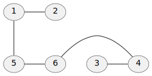
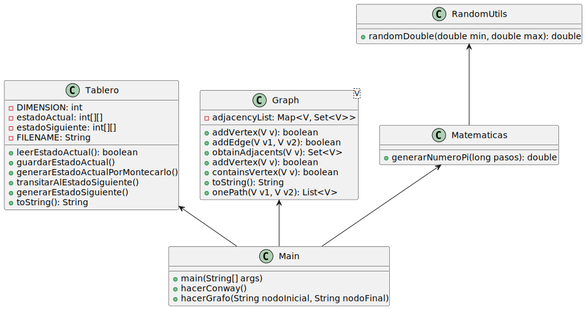

# evaluacion-1-victor-fernandez-montano
Repositorio para el examen de evaluacion de la asignatura Técnicas de Programación

## Información para los usuarios

### Prerequisitos
* Java 23.0.1+

### Instalación

Puedes utilizar el archivo ya compilado que se encuentra en la pestaña [Releases](https://github.com/KeyKoder/evaluacion-1-victor-fernandez-montano/releases) o compilarlo desde cero.

Para compilarlo desde cero, sigue los siguientes pasos:

1. Clona el repositorio

    ```
    git clone https://github.com/KeyKoder/evaluacion-1-victor-fernandez-montano.git
    ```

2. Utilizando Maven, ejecuta el siguiente comando

    ```
    mvn clean compile jar:jar
    ```

3. Navega a la carpeta `target`, donde debería de haber aparecido un archivo `.jar`. Ejecútalo desde la consola utilizando java.

### Como utilizar

Para utilizar el programa, si se ejecuta sin ningún parámetro se explicará lo que tiene que ir haciendo.

En cualquier caso, se tiene que pasar como parámetro de consola el número de la práctica que se quiere probar.

En el caso de la práctica 1, también tienes que pasar como parámetro la cantidad de puntos a generar para calcular pi.

En el caso de la práctica 2, no necesitas parámetros extras, sin embargo, para modificar la configuración inicial se tiene que añadir o modificar el fichero 'matriz', que se tendría que encontrar
en la misma carpeta que el ejecutable.

El formato a utilizar es el siguiente: `1` significa que la celda está viva, `0` significa que la celda está muerta.

Estas celdas están dispuestas en 30 líneas de 30 caracteres cada una, no se pueden añadir más líneas ni mas celdas a cada línea.

Un ejemplo de matriz posible es el siguiente:
```
000000000000000000000000000000
000000000000000000000000000000
000000000000000000111000000000
000000010000000000000000000000
000001010000000000000000000000
000000110000000000000000000000
000000000000000000000000000000
000000000000000000000000000000
000010000000000000000000000000
000010000000000000000000000000
000010000000000000000000000000
000010000000000000000000000000
000010000000000000000000000000
000000000000000000000000000000
000000000000000000000000000000
000000000000000000000000000000
000000000000000000000000000000
000000000000000000000000000000
000000000000000000000000000000
000000000000000000000000000000
000000000000000000000000000000
000000000000000000000000000000
000000000000000000000000000000
000000000000000000000000000000
000000000000000000000000000000
000000000000000000000000000000
000000000000000000000000000000
000000000000000000000000000000
000000000000000000000000000000
000000000000000000000000000000
```


En el caso de la práctica 3, para modificar el grafo utilizado, hay que crear o modificar el fichero 'graph' que se tiene que encontrar en la misma carpeta que el ejecutable, el formato es el siguiente:
```
1 - 2, 5
2 - 1
3 - 4
4 - 3, 6
5 - 1, 6
6 - 4, 5
```

o

```
1 - 2
3 - 4
1 - 5
5 - 6
6 - 4
```

Ambos formatos son equivalentes y corresponden al siguiente grafo:



Además, se tiene que aportar mediante los parámetros de consola el nodo inicial y el nodo final del camino a calcular.

## Información para los desarrolladores
Para generar la documentación, ejecuta el siguiente goal de maven:

```
mvn javadoc:javadoc
```

### Complejidad de los métodos
En la clase `mates.Matematicas`, `n` se corresponde con el numero de pasos para calcular pi:

`mates.Matematicas.generarNumeroPi`: `O(n)`

`mates.RandomUtils.randomDouble`: `O(1)`

---

En `dominio.Tablero`, `n` se corresponde con las dimensiones del tablero:

`dominio.Tablero.leerEstadoActual`: `O(n)`

`dominio.Tablero.guardarEstadoActual`: `O(n^2)`

`dominio.Tablero.generarEstadoActualPorMontecarlo`: `O(n^2)`

`dominio.Tablero.transitarAlEstadoSiguiente`: `O(n^2)`

`dominio.Tablero.generarEstadoSiguiente`: `O(n^2)`

`dominio.Tablero.toString`: `O(n^2)`

---

En `pr2.Graph`, `n` se corresponde con los vértices del grafo:

`pr2.Graph.addVertex`: `O(1)`

`pr2.Graph.addEdge`: `O(1)`

`pr2.Graph.obtainAdjacents`: `O(1)`

`pr2.Graph.containsVertex`: `O(1)`

`pr2.Graph.toString`: `O(n)`

`pr2.Graph.onePath`: `O(n^2)` en el peor de los casos

`pr2.Graph.leerDeArchivo`: `O(n)`

## Diagrama UML


---

# Enlace al repositorio
[https://github.com/KeyKoder/evaluacion-1-victor-fernandez-montano.git](https://github.com/KeyKoder/evaluacion-1-victor-fernandez-montano.git)
